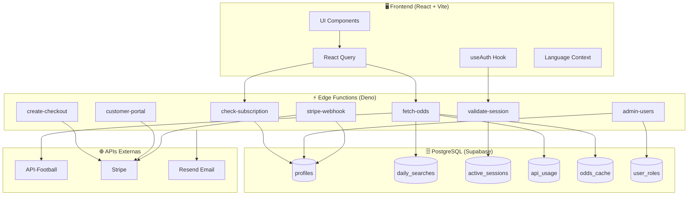
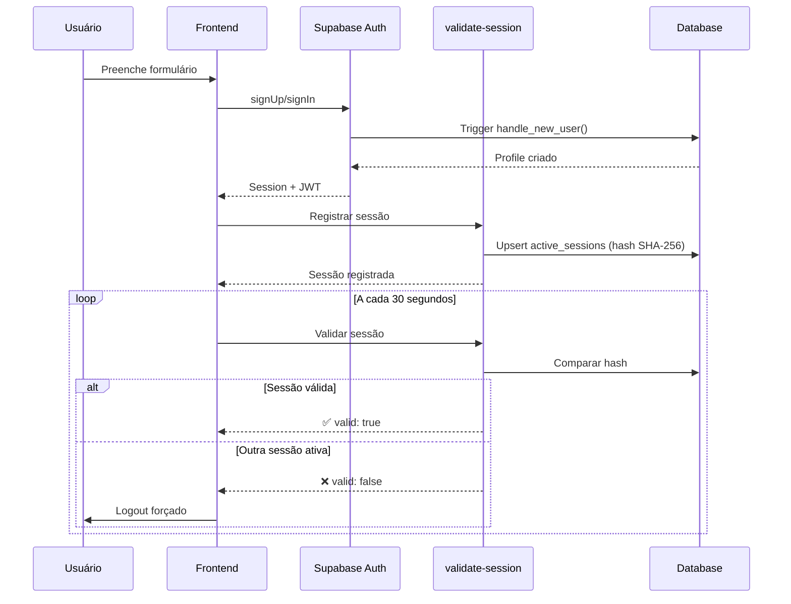
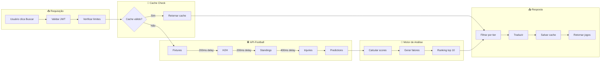
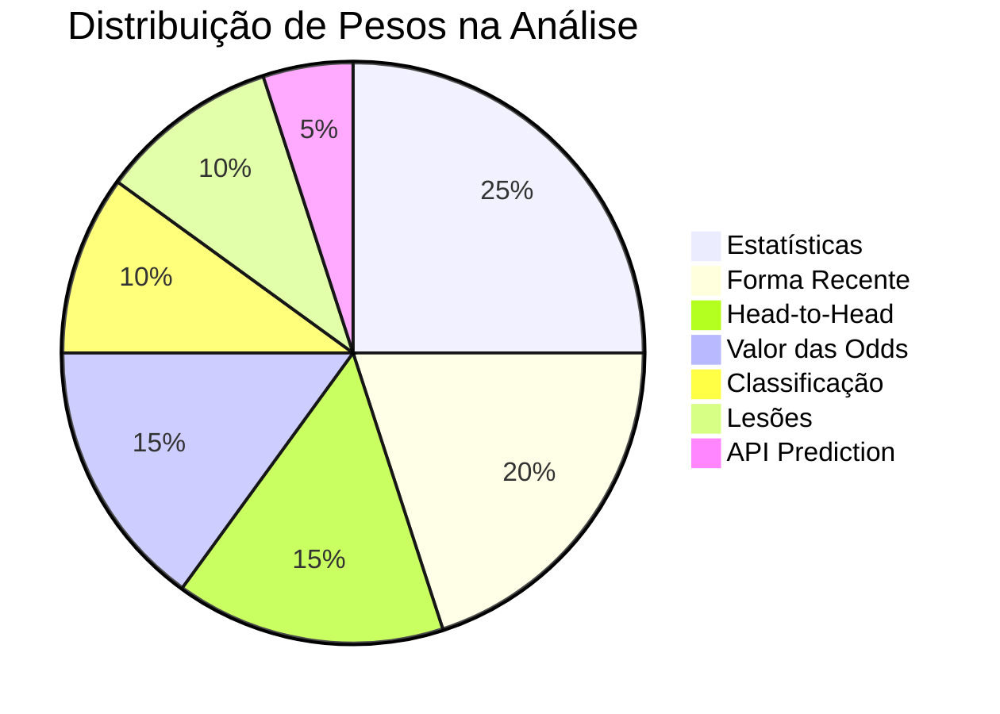
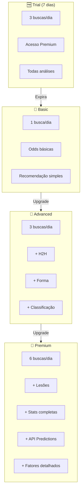
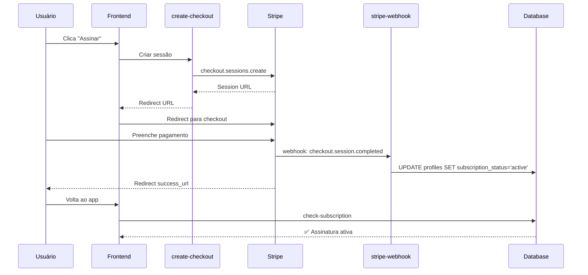
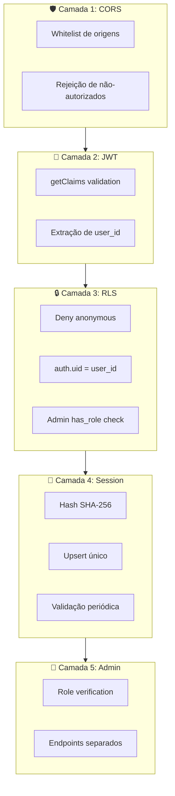
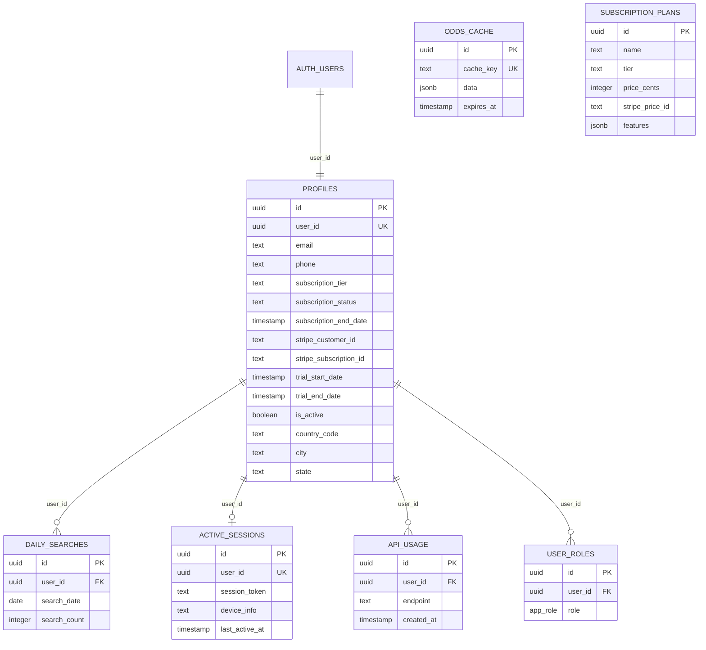
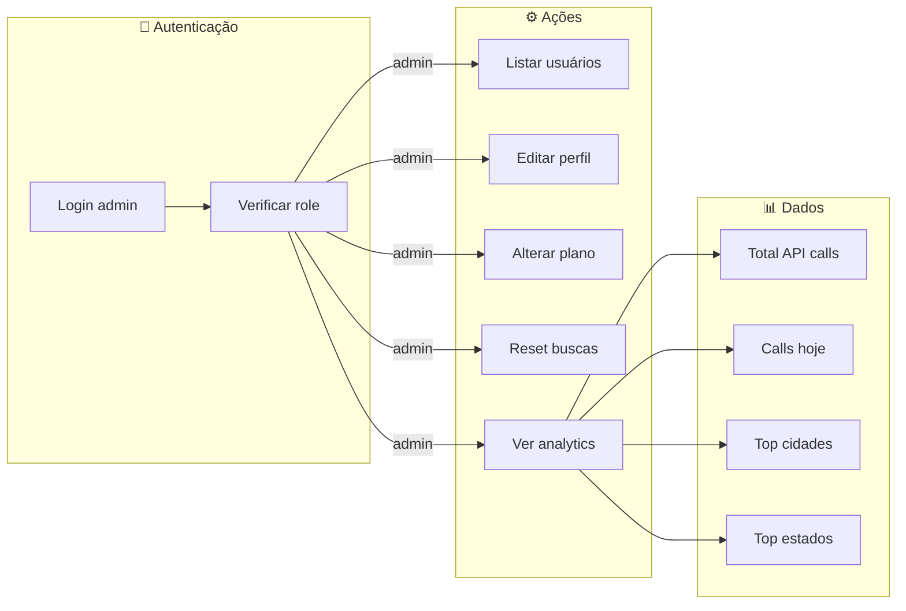

# EUGINE - Documentação Técnica Completa

## 🎨 Diagramas de Arquitetura

### Arquitetura Geral do Sistema



### Fluxo de Autenticação



### Fluxo de Busca de Odds



### Motor de Análise - Pesos



### Sistema de Tiers



### Fluxo de Pagamento Stripe



### Arquitetura de Segurança



### Estrutura do Banco de Dados



### Fluxo do Admin Panel



---
## Sistema Profissional de Análise de Apostas Esportivas

**Versão:** 3.0  
**Data:** Janeiro 2026  
**Desenvolvido por:** GS ItalyInvestments / EugineAnalytics

---

## 📋 Índice

1. [Visão Geral do Sistema](#1-visão-geral-do-sistema)
2. [Arquitetura Técnica](#2-arquitetura-técnica)
3. [Banco de Dados](#3-banco-de-dados)
4. [Motor de Análise](#4-motor-de-análise)
5. [Edge Functions](#5-edge-functions)
6. [Sistema de Autenticação](#6-sistema-de-autenticação)
7. [Planos e Assinaturas](#7-planos-e-assinaturas)
8. [Segurança](#8-segurança)
9. [APIs Externas](#9-apis-externas)
10. [Frontend](#10-frontend)
11. [Guia de Migração](#11-guia-de-migração)

---

## 1. Visão Geral do Sistema

### 1.1 Propósito
EUGINE é um sistema de análise de apostas esportivas que consome dados da API-Football para gerar recomendações automáticas de alta probabilidade em futebol.

### 1.2 Funcionalidades Principais
- Análise automatizada de partidas de futebol
- Recomendações baseadas em dados estatísticos
- Sistema de confiança (0-100%)
- Diferentes níveis de análise por tier de assinatura
- Anti-multi-login (uma sessão por conta)
- Painel administrativo completo
- Suporte multilíngue (PT/EN)

### 1.3 Stack Tecnológica
```
Frontend:
- React 18.3.1
- TypeScript
- Vite
- Tailwind CSS
- shadcn/ui
- React Query
- React Router DOM

Backend:
- Supabase (PostgreSQL)
- Supabase Edge Functions (Deno)
- Row Level Security (RLS)

Integrações:
- API-Football (dados esportivos)
- Stripe (pagamentos)
- Resend (emails)
```

---

## 2. Arquitetura Técnica

### 2.1 Fluxo de Dados
```
┌─────────────────┐     ┌──────────────────┐     ┌─────────────────┐
│    Frontend     │────▶│  Edge Functions  │────▶│  API-Football   │
│    (React)      │◀────│   (Supabase)     │◀────│   (Externo)     │
└─────────────────┘     └──────────────────┘     └─────────────────┘
                               │
                               ▼
                        ┌──────────────────┐
                        │    PostgreSQL    │
                        │   (Supabase)     │
                        └──────────────────┘
```

### 2.2 Estratégia de Cache
- Cache de 10 minutos para dados da API-Football
- Armazenado na tabela `odds_cache`
- Tradução dinâmica em tempo real (não afeta cache)
- Cleanup automático de cache expirado via função SQL

### 2.3 Controle de Rate Limiting
- Delays sequenciais entre chamadas à API (200-400ms)
- Evita suspensão de conta por excesso de requisições
- Sistema de detecção e log de falhas de API

---

## 3. Banco de Dados

### 3.1 Diagrama ER
```
┌──────────────────────────────────────────────────────────────────┐
│                          auth.users                               │
│  (Gerenciado pelo Supabase Auth)                                 │
└──────────────────────────────────────────────────────────────────┘
           │
           │ user_id (UUID)
           ▼
┌──────────────────────────────────────────────────────────────────┐
│                          profiles                                 │
├──────────────────────────────────────────────────────────────────┤
│ id (UUID, PK)                                                    │
│ user_id (UUID, UNIQUE) ──────────────────────────────────────────│
│ email (TEXT, NOT NULL)                                           │
│ phone (TEXT, NULLABLE)                                           │
│ subscription_tier (TEXT, DEFAULT 'free')                         │
│ subscription_status (TEXT, DEFAULT 'inactive')                   │
│ subscription_end_date (TIMESTAMPTZ, NULLABLE)                    │
│ stripe_customer_id (TEXT, NULLABLE)                              │
│ stripe_subscription_id (TEXT, NULLABLE)                          │
│ trial_start_date (TIMESTAMPTZ, DEFAULT now())                    │
│ trial_end_date (TIMESTAMPTZ, DEFAULT now() + 7 days)             │
│ is_active (BOOLEAN, DEFAULT true)                                │
│ country_code (TEXT, DEFAULT 'BR')                                │
│ timezone (TEXT, DEFAULT 'America/Sao_Paulo')                     │
│ city (TEXT, NULLABLE)                                            │
│ state (TEXT, NULLABLE)                                           │
│ created_at (TIMESTAMPTZ)                                         │
│ updated_at (TIMESTAMPTZ)                                         │
└──────────────────────────────────────────────────────────────────┘
           │
           │ user_id
           ▼
┌──────────────────────────────────────────────────────────────────┐
│                       daily_searches                              │
├──────────────────────────────────────────────────────────────────┤
│ id (UUID, PK)                                                    │
│ user_id (UUID, NOT NULL)                                         │
│ search_date (DATE, DEFAULT CURRENT_DATE)                         │
│ search_count (INTEGER, DEFAULT 0)                                │
│ created_at / updated_at                                          │
│ UNIQUE(user_id, search_date)                                     │
└──────────────────────────────────────────────────────────────────┘

┌──────────────────────────────────────────────────────────────────┐
│                       active_sessions                             │
├──────────────────────────────────────────────────────────────────┤
│ id (UUID, PK)                                                    │
│ user_id (UUID, NOT NULL, UNIQUE)                                 │
│ session_token (TEXT, NOT NULL) ← Hash SHA-256                    │
│ device_info (TEXT, NULLABLE)                                     │
│ ip_address (TEXT, NULLABLE)                                      │
│ last_active_at (TIMESTAMPTZ)                                     │
│ created_at (TIMESTAMPTZ)                                         │
└──────────────────────────────────────────────────────────────────┘

┌──────────────────────────────────────────────────────────────────┐
│                         api_usage                                 │
├──────────────────────────────────────────────────────────────────┤
│ id (UUID, PK)                                                    │
│ user_id (UUID, NOT NULL)                                         │
│ endpoint (TEXT, NOT NULL)                                        │
│ created_at (TIMESTAMPTZ)                                         │
└──────────────────────────────────────────────────────────────────┘

┌──────────────────────────────────────────────────────────────────┐
│                        user_roles                                 │
├──────────────────────────────────────────────────────────────────┤
│ id (UUID, PK)                                                    │
│ user_id (UUID, NOT NULL)                                         │
│ role (app_role ENUM: 'admin' | 'user')                          │
│ created_at (TIMESTAMPTZ)                                         │
└──────────────────────────────────────────────────────────────────┘

┌──────────────────────────────────────────────────────────────────┐
│                      subscription_plans                           │
├──────────────────────────────────────────────────────────────────┤
│ id (UUID, PK)                                                    │
│ name (TEXT, NOT NULL)                                            │
│ tier (TEXT, NOT NULL)                                            │
│ price_cents (INTEGER, NOT NULL)                                  │
│ currency (TEXT, DEFAULT 'brl')                                   │
│ features (JSONB, DEFAULT '[]')                                   │
│ stripe_price_id (TEXT, NULLABLE)                                 │
│ created_at (TIMESTAMPTZ)                                         │
└──────────────────────────────────────────────────────────────────┘

┌──────────────────────────────────────────────────────────────────┐
│                         odds_cache                                │
├──────────────────────────────────────────────────────────────────┤
│ id (UUID, PK)                                                    │
│ cache_key (TEXT, NOT NULL, UNIQUE)                               │
│ data (JSONB, NOT NULL)                                           │
│ expires_at (TIMESTAMPTZ, NOT NULL)                               │
│ created_at (TIMESTAMPTZ)                                         │
└──────────────────────────────────────────────────────────────────┘
```

### 3.2 Funções SQL

#### increment_search_count(p_user_id UUID) → JSONB
```sql
-- Incrementa contador de buscas diárias
-- Verifica limites por tier:
--   - Trial: 3 buscas/dia (acesso premium)
--   - Basic: 1 busca/dia
--   - Advanced: 3 buscas/dia
--   - Premium: 6 buscas/dia
-- Retorna: {allowed, remaining, is_trial, tier, max_searches, message}
```

#### get_remaining_searches(p_user_id UUID) → JSONB
```sql
-- Retorna buscas restantes sem incrementar
-- Retorna: {remaining, is_trial, tier, max_searches}
```

#### has_role(_user_id UUID, _role app_role) → BOOLEAN
```sql
-- Verifica se usuário tem determinada role
```

#### handle_new_user() → TRIGGER
```sql
-- Trigger disparado após INSERT em auth.users
-- Cria automaticamente perfil na tabela profiles
```

#### cleanup_expired_cache() → VOID
```sql
-- Remove entradas expiradas da odds_cache
```

### 3.3 Políticas RLS (Row Level Security)

#### Padrão de Segurança
Todas as tabelas sensíveis implementam:
1. **Deny anonymous access**: Bloqueia usuários não autenticados
2. **User-scoped access**: `auth.uid() = user_id`
3. **Admin override**: Apenas para visualização via `has_role()`

```sql
-- Exemplo padrão para tabelas de usuário
CREATE POLICY "Deny anonymous access" ON public.TABLE_NAME 
FOR ALL TO anon USING (false) WITH CHECK (false);

CREATE POLICY "Users can view own data" ON public.TABLE_NAME 
FOR SELECT USING (auth.uid() = user_id);

CREATE POLICY "Users can insert own data" ON public.TABLE_NAME 
FOR INSERT WITH CHECK (auth.uid() = user_id);

CREATE POLICY "Users can update own data" ON public.TABLE_NAME 
FOR UPDATE USING (auth.uid() = user_id) WITH CHECK (auth.uid() = user_id);

CREATE POLICY "Users can delete own data" ON public.TABLE_NAME 
FOR DELETE USING (auth.uid() = user_id);
```

---

## 4. Motor de Análise

### 4.1 Arquitetura do Motor
O motor de análise processa múltiplas fontes de dados para gerar recomendações.

```
┌─────────────────────────────────────────────────────────────────┐
│                    MOTOR DE ANÁLISE EUGINE                      │
├─────────────────────────────────────────────────────────────────┤
│                                                                 │
│  ┌─────────────┐  ┌─────────────┐  ┌─────────────┐             │
│  │    H2H      │  │   Form      │  │  Standings  │             │
│  │  (10-20%)   │  │  (15-25%)   │  │  (10-15%)   │             │
│  └──────┬──────┘  └──────┬──────┘  └──────┬──────┘             │
│         │                │                │                     │
│         └────────────────┼────────────────┘                     │
│                          ▼                                      │
│  ┌─────────────┐  ┌─────────────┐  ┌─────────────┐             │
│  │  Injuries   │  │ Statistics  │  │   Odds      │             │
│  │   (5-15%)   │  │  (20-30%)   │  │  (10-20%)   │             │
│  └──────┬──────┘  └──────┬──────┘  └──────┬──────┘             │
│         │                │                │                     │
│         └────────────────┼────────────────┘                     │
│                          ▼                                      │
│              ┌───────────────────────┐                          │
│              │   CONFIDENCE SCORE    │                          │
│              │       (0-100%)        │                          │
│              └───────────┬───────────┘                          │
│                          ▼                                      │
│              ┌───────────────────────┐                          │
│              │    RECOMMENDATION     │                          │
│              │  + ANALYSIS FACTORS   │                          │
│              └───────────────────────┘                          │
└─────────────────────────────────────────────────────────────────┘
```

### 4.2 Tipos de Análise por Tier

| Tier     | Dados Disponíveis                                           |
|----------|-------------------------------------------------------------|
| Basic    | Odds + Recomendação simples                                 |
| Advanced | + H2H, Forma, Classificação                                 |
| Premium  | + Lesões, Estatísticas completas, API Predictions           |
| Trial    | Acesso Premium por 7 dias (3 buscas/dia)                    |

### 4.3 Tipos de Recomendação

```typescript
type BetType = 
  | 'home'           // Vitória casa
  | 'away'           // Vitória visitante
  | 'draw'           // Empate
  | 'over'           // Mais de 2.5 gols
  | 'under'          // Menos de 2.5 gols
  | 'btts_yes'       // Ambas marcam - Sim
  | 'btts_no'        // Ambas marcam - Não
  | 'double_chance'  // Dupla chance
  | 'skip';          // Não apostar (risco alto)
```

### 4.4 Cálculo de Confiança

```typescript
interface ConfidenceCalculation {
  // Pesos base por fator
  weights: {
    h2h: 0.15,           // Head-to-Head histórico
    form: 0.20,          // Forma recente (últimos 5 jogos)
    standings: 0.10,     // Posição na tabela
    statistics: 0.25,    // Estatísticas de gols
    injuries: 0.10,      // Impacto de lesões
    odds: 0.15,          // Valor das odds
    apiPrediction: 0.05  // Previsão da API-Football
  };

  // Fórmula simplificada
  confidence = Σ(factor_score * factor_weight) * 100;
  
  // Ajustes
  if (h2h_games < 3) weights.h2h *= 0.5;
  if (key_player_injured) confidence -= 10;
  if (derby_match) confidence -= 5; // Mais imprevisível
}
```

### 4.5 Fatores de Análise

```typescript
interface AnalysisFactor {
  name: string;                           // Nome do fator
  impact: 'positive' | 'negative' | 'neutral';
  weight: number;                         // 0-1
  description: string;                    // Explicação
}

// Exemplos de fatores
const factors: AnalysisFactor[] = [
  {
    name: 'H2H Dominance',
    impact: 'positive',
    weight: 0.8,
    description: 'Time da casa venceu 4 dos últimos 5 confrontos diretos'
  },
  {
    name: 'Away Form',
    impact: 'negative', 
    weight: 0.6,
    description: 'Visitante não vence fora há 6 jogos'
  },
  {
    name: 'Key Injuries',
    impact: 'negative',
    weight: 0.4,
    description: 'Artilheiro do time da casa está lesionado'
  }
];
```

### 4.6 Seleção de Jogos

O sistema prioriza ligas de elite através de um sistema de tiers:

```typescript
const LEAGUE_PRIORITY = {
  tier1: [
    39,   // Premier League (England)
    140,  // La Liga (Spain)
    135,  // Serie A (Italy)
    78,   // Bundesliga (Germany)
    61,   // Ligue 1 (France)
    2,    // Champions League
    3,    // Europa League
  ],
  tier2: [
    71,   // Brasileirão Serie A
    94,   // Primeira Liga (Portugal)
    88,   // Eredivisie (Netherlands)
    // ... outras ligas relevantes
  ],
  tier3: [
    // Ligas secundárias
  ]
};

// Seleciona 10 melhores de 20 candidatos
// baseando-se em score de qualidade (0-100)
function selectTopGames(candidates: Game[]): Game[] {
  return candidates
    .map(game => ({
      ...game,
      qualityScore: calculateQualityScore(game)
    }))
    .sort((a, b) => b.qualityScore - a.qualityScore)
    .slice(0, 10);
}
```

---

## 5. Edge Functions

### 5.1 Arquitetura Geral

```
supabase/functions/
├── admin-users/        # Gestão de usuários (admin)
├── check-subscription/ # Verificação de assinatura
├── create-checkout/    # Criar sessão Stripe
├── customer-portal/    # Portal do cliente Stripe
├── fetch-odds/         # Busca e análise de odds
├── send-trial-reminder/# Emails de lembrete de trial
├── stripe-webhook/     # Webhooks do Stripe
└── validate-session/   # Validação anti-multi-login
```

### 5.2 fetch-odds (Principal)

```typescript
// Fluxo da função fetch-odds
async function handler(req: Request) {
  // 1. Validação de autenticação
  const claims = await supabaseClient.auth.getClaims(token);
  
  // 2. Verificar limites de busca
  const searchResult = await incrementSearchCount(userId);
  if (!searchResult.allowed) {
    return { error: 'Daily limit reached', remaining: 0 };
  }
  
  // 3. Verificar cache
  const cached = await getFromCache('odds_today');
  if (cached) {
    return translateAndFilter(cached, userTier, language);
  }
  
  // 4. Buscar dados da API-Football
  const fixtures = await fetchFixtures();
  
  // 5. Para cada jogo, buscar dados avançados (com delays)
  for (const fixture of fixtures) {
    await delay(200);
    const h2h = await fetchH2H(fixture);
    await delay(200);
    const standings = await fetchStandings(fixture);
    await delay(400);
    const injuries = await fetchInjuries(fixture);
    // ...
  }
  
  // 6. Calcular análises
  const analyzed = fixtures.map(analyzeGame);
  
  // 7. Selecionar top 10 jogos
  const topGames = selectTopGames(analyzed);
  
  // 8. Salvar cache
  await saveToCache('odds_today', topGames, 10); // 10 min
  
  // 9. Retornar dados filtrados por tier
  return filterByTier(topGames, userTier);
}
```

### 5.3 validate-session (Anti-Multi-Login)

```typescript
async function handler(req: Request) {
  const { sessionToken, action } = await req.json();
  
  // Hash do token para segurança
  const hashedToken = await sha256(sessionToken);
  
  if (action === 'register') {
    // Upsert: invalida sessão anterior automaticamente
    await supabase
      .from('active_sessions')
      .upsert({
        user_id: userId,
        session_token: hashedToken,
        device_info: req.headers.get('User-Agent'),
        last_active_at: new Date()
      }, { onConflict: 'user_id' });
  }
  
  if (action === 'validate') {
    // Verifica se token atual é o válido
    const { data } = await supabase
      .from('active_sessions')
      .select('session_token')
      .eq('user_id', userId)
      .single();
    
    if (data?.session_token !== hashedToken) {
      return { valid: false, reason: 'SESSION_INVALIDATED' };
    }
  }
  
  return { valid: true };
}
```

### 5.4 admin-users

```typescript
// Ações disponíveis
type AdminAction = 
  | 'list_users'      // Listar todos usuários
  | 'update_user'     // Atualizar dados de usuário
  | 'reset_searches'  // Zerar contador de buscas
  | 'set_searches'    // Definir número de buscas
  | 'get_analytics';  // Obter métricas

// Verificação de admin
const isAdmin = await hasRole(userId, 'admin');
if (!isAdmin) throw new Error('Unauthorized');
```

### 5.5 stripe-webhook

```typescript
// Eventos tratados
const events = {
  'checkout.session.completed': async (session) => {
    // Atualiza profile com dados de assinatura
    await updateProfile(session.client_reference_id, {
      subscription_status: 'active',
      subscription_tier: extractTier(session),
      stripe_customer_id: session.customer,
      stripe_subscription_id: session.subscription,
      subscription_end_date: calculateEndDate()
    });
  },
  
  'customer.subscription.updated': async (subscription) => {
    // Atualiza tier se mudou
    // Respeita hasManualAccess para não sobrescrever
  },
  
  'customer.subscription.deleted': async (subscription) => {
    // Marca como inativo
    await updateProfile(customerId, {
      subscription_status: 'inactive',
      subscription_tier: 'free'
    });
  }
};
```

---

## 6. Sistema de Autenticação

### 6.1 Fluxo de Autenticação

```
┌──────────────┐     ┌──────────────┐     ┌──────────────┐
│   Signup     │────▶│  Supabase    │────▶│   Trigger    │
│   Form       │     │    Auth      │     │ handle_new_  │
└──────────────┘     └──────────────┘     │    user()    │
                                          └──────┬───────┘
                                                 │
                                                 ▼
┌──────────────┐     ┌──────────────┐     ┌──────────────┐
│   validate-  │◀────│   Login      │────▶│   profiles   │
│   session    │     │   Success    │     │   (criado)   │
└──────────────┘     └──────────────┘     └──────────────┘
       │
       │ Registra sessão única
       ▼
┌──────────────┐
│   active_    │
│   sessions   │
└──────────────┘
```

### 6.2 Validação Periódica (Frontend)

```typescript
// useAuth.tsx - Intervalo de 30s
useEffect(() => {
  const interval = setInterval(async () => {
    const isValid = await validateSession();
    if (!isValid) {
      await supabase.auth.signOut();
      toast.error('Sessão encerrada em outro dispositivo');
    }
  }, 30000);
  
  return () => clearInterval(interval);
}, []);
```

### 6.3 Campos de Signup

```typescript
interface SignupData {
  email: string;           // Obrigatório
  password: string;        // Obrigatório (min 6 chars)
  phone: string;           // Obrigatório (formato BR)
  city?: string;           // Opcional
  state?: string;          // Opcional
  country_code: string;    // Default: 'BR'
  timezone: string;        // Default: 'America/Sao_Paulo'
}
```

---

## 7. Planos e Assinaturas

### 7.1 Estrutura de Planos

| Plano    | Preço/mês | Buscas/dia | Funcionalidades                    |
|----------|-----------|------------|-------------------------------------|
| Trial    | Grátis    | 3          | Premium por 7 dias                  |
| Basic    | R$29,90   | 1          | Odds + Recomendação simples         |
| Advanced | R$49,90   | 3          | + H2H, Forma, Classificação         |
| Premium  | R$79,90   | 6          | + Lesões, Stats, API Predictions    |

### 7.2 Lógica de Expiração

```typescript
// Verificação de acesso
function checkAccess(profile: Profile): AccessResult {
  const now = new Date();
  
  // Usuário com assinatura ativa
  if (profile.subscription_status === 'active' && 
      profile.subscription_end_date > now) {
    return { 
      hasAccess: true, 
      tier: profile.subscription_tier 
    };
  }
  
  // Usuário em trial
  if (profile.trial_end_date > now && 
      profile.subscription_status !== 'active') {
    return { 
      hasAccess: true, 
      tier: 'premium', // Trial = Premium access
      isTrial: true,
      daysRemaining: daysDiff(profile.trial_end_date, now)
    };
  }
  
  // Sem acesso
  return { hasAccess: false, tier: 'free' };
}
```

### 7.3 Integração Stripe

```typescript
// Fluxo de pagamento
1. Frontend → create-checkout (Edge Function)
2. Edge Function → Stripe Checkout Session
3. Usuário → Stripe Checkout Page
4. Stripe → stripe-webhook (success)
5. Webhook → Update profiles table
6. Frontend → check-subscription → Access granted
```

---

## 8. Segurança

### 8.1 Camadas de Proteção

```
┌─────────────────────────────────────────────────────────────────┐
│                      CAMADAS DE SEGURANÇA                       │
├─────────────────────────────────────────────────────────────────┤
│                                                                 │
│  1. CORS (Edge Functions)                                       │
│     - Whitelist de origens permitidas                           │
│     - Rejeição de origens não autorizadas                       │
│                                                                 │
│  2. JWT Validation (supabase.auth.getClaims)                    │
│     - Validação de token em todas as funções                    │
│     - Extração segura de user_id                                │
│                                                                 │
│  3. Row Level Security (PostgreSQL)                             │
│     - Deny anonymous access em todas tabelas sensíveis          │
│     - Scoping por auth.uid() = user_id                          │
│                                                                 │
│  4. Anti-Multi-Login                                            │
│     - Hash SHA-256 dos tokens de sessão                         │
│     - Upsert para invalidar sessões anteriores                  │
│                                                                 │
│  5. Admin Role Check                                            │
│     - Função has_role() para verificar privilégios              │
│     - Separação de endpoints admin                              │
│                                                                 │
└─────────────────────────────────────────────────────────────────┘
```

### 8.2 CORS Configuration

```typescript
const ALLOWED_ORIGINS = [
  'https://eugineai.com',
  'https://www.eugineai.com',
  'https://eugine-analytics.com',
  'https://www.eugine-analytics.com',
  'https://game-smart-pro.lovable.app'
];

// Também aceita:
// - Lovable preview URLs (regex match)
// - localhost:5173, localhost:3000
// - 127.0.0.1:5173
```

### 8.3 Secrets (Environment Variables)

```
SUPABASE_URL              # URL do projeto Supabase
SUPABASE_ANON_KEY         # Chave pública
SUPABASE_SERVICE_ROLE_KEY # Chave admin (apenas Edge Functions)
API_FOOTBALL_KEY          # Chave da API-Football
STRIPE_SECRET_KEY         # Chave secreta Stripe
STRIPE_WEBHOOK_SECRET     # Secret do webhook Stripe
RESEND_API_KEY            # Chave da API Resend (emails)
```

---

## 9. APIs Externas

### 9.1 API-Football

**Base URL:** `https://api-football-v1.p.rapidapi.com/v3`

**Endpoints utilizados:**

| Endpoint        | Uso                                    |
|-----------------|----------------------------------------|
| `/fixtures`     | Lista de partidas por data             |
| `/odds`         | Odds de casas de apostas               |
| `/fixtures/h2h` | Head-to-Head entre times               |
| `/standings`    | Classificação da liga                  |
| `/injuries`     | Jogadores lesionados                   |
| `/teams/stats`  | Estatísticas do time                   |
| `/predictions`  | Previsões da API                       |

**Rate Limiting:**
- Delays de 200-400ms entre chamadas
- Cache de 10 minutos para reduzir chamadas

### 9.2 Stripe

**Produtos/Preços:**
- Configurados no Stripe Dashboard
- IDs armazenados na tabela `subscription_plans`

**Webhooks:**
- Endpoint: `/functions/v1/stripe-webhook`
- Eventos: `checkout.session.completed`, `customer.subscription.*`

### 9.3 Resend (Emails)

**Uso:**
- Lembretes de expiração de trial
- Notificações de assinatura

---

## 10. Frontend

### 10.1 Estrutura de Páginas

```
src/pages/
├── Index.tsx          # Dashboard principal (jogos)
├── Auth.tsx           # Login/Signup
├── Profile.tsx        # Perfil do usuário
├── Admin.tsx          # Painel administrativo
├── ResetPassword.tsx  # Recuperação de senha
├── PrivacyPolicy.tsx  # Política de privacidade
├── TermsOfUse.tsx     # Termos de uso
└── NotFound.tsx       # 404
```

### 10.2 Componentes Principais

```
src/components/
├── Header.tsx              # Navegação principal
├── GameCard.tsx            # Card de jogo individual
├── AccumulatorsSection.tsx # Seção de acumuladores
├── ZebraSection.tsx        # Seção zebra (análises)
├── PremiumDoubleSection.tsx# Duplas premium
├── PricingSection.tsx      # Cards de preços
├── TrialBanner.tsx         # Banner de trial/assinatura
├── ProtectedRoute.tsx      # Rota protegida
├── LanguageSelector.tsx    # Seletor PT/EN
└── ui/                     # Componentes shadcn
```

### 10.3 Hooks Customizados

```typescript
// useAuth.tsx - Autenticação e sessão
const { user, session, loading, signIn, signUp, signOut } = useAuth();

// useAdmin.tsx - Funcionalidades admin
const { 
  isAdmin, 
  users, 
  fetchUsers, 
  updateUser, 
  resetSearches,
  analytics 
} = useAdmin();

// use-mobile.tsx - Detecção mobile
const isMobile = useMobile();
```

### 10.4 Contextos

```typescript
// LanguageContext.tsx
const { language, setLanguage, t } = useLanguage();
// Suporta 'pt' e 'en'
```

### 10.5 Tipos TypeScript

```typescript
// src/types/game.ts
interface Game {
  id: string;
  homeTeam: string;
  awayTeam: string;
  homeTeamId?: number;
  awayTeamId?: number;
  league: string;
  leagueId?: number;
  season?: number;
  startTime: Date;
  bookmaker: string;
  odds: {
    home: number;
    draw: number;
    away: number;
    over: number;
    under: number;
  };
  dayType?: 'today' | 'tomorrow' | 'future';
  dayLabel?: string;
  analysis?: BettingAnalysis;
  advancedData?: AdvancedGameData;
}

interface BettingAnalysis {
  type: string;          // Tipo da aposta recomendada
  reason: string;        // Justificativa
  profit: number;        // Lucro potencial
  confidence?: number;   // 0-100
  factors?: AnalysisFactor[];
}

interface AdvancedGameData {
  h2h?: { ... };
  homeStats?: TeamStats;
  awayStats?: TeamStats;
  homePosition?: number;
  awayPosition?: number;
  homeForm?: string;     // "WWDLW"
  awayForm?: string;
  homeInjuries?: number;
  awayInjuries?: number;
  apiPrediction?: { ... };
}
```

---

## 11. Guia de Migração

### 11.1 Para migrar o Frontend

1. **Framework alternativo:** Next.js, Vue, Angular
2. **Manter:**
   - Lógica de autenticação Supabase
   - Estrutura de tipos TypeScript
   - Integração com Edge Functions
3. **Adaptar:**
   - Componentes UI para framework escolhido
   - Roteamento
   - Estado global (React Query → Vue Query, etc.)

### 11.2 Para migrar o Backend

1. **Alternativas ao Supabase:**
   - Firebase + Cloud Functions
   - AWS (RDS + Lambda + API Gateway)
   - Custom Node.js/Python server

2. **Replicar:**
   - Estrutura de banco de dados
   - Lógica de RLS (implementar middleware)
   - Edge Functions → Express routes / Lambda
   - Autenticação JWT

3. **Migrar dados:**
   ```sql
   -- Export de dados
   pg_dump -h <host> -U postgres -d postgres \
     --data-only --table=profiles > profiles.sql
   ```

### 11.3 Checklist de Migração

- [ ] Exportar esquema do banco
- [ ] Exportar dados existentes
- [ ] Replicar funções SQL
- [ ] Implementar autenticação equivalente
- [ ] Migrar lógica das Edge Functions
- [ ] Configurar integrações (Stripe, API-Football)
- [ ] Testar fluxos críticos:
  - [ ] Signup/Login
  - [ ] Busca de odds
  - [ ] Pagamento
  - [ ] Admin panel
- [ ] Configurar CORS e segurança
- [ ] Migrar secrets/env vars

---

## Apêndice A: Prompt para IAs

```
Você é um assistente especializado no sistema EUGINE, uma plataforma profissional 
de análise de apostas esportivas desenvolvida pela GS ItalyInvestments.

EUGINE é um sistema que:
1. Consome dados da API-Football (fixtures, odds, H2H, standings, injuries, predictions)
2. Processa esses dados através de um motor de análise proprietário
3. Gera recomendações de apostas com scores de confiança (0-100%)
4. Oferece diferentes níveis de acesso por tier de assinatura (Basic/Advanced/Premium)
5. Implementa segurança robusta com RLS, anti-multi-login e validação JWT

Arquitetura técnica:
- Frontend: React + TypeScript + Vite + Tailwind + shadcn/ui
- Backend: Supabase (PostgreSQL + Edge Functions em Deno)
- Pagamentos: Stripe
- Email: Resend

Funcionalidades principais:
- Análise de partidas de futebol com H2H, forma, classificação, lesões
- Sistema de assinaturas com trial de 7 dias
- Painel administrativo para gestão de usuários
- Suporte a português e inglês
- Anti-multi-login (uma sessão por usuário)
- Cache de 10 minutos para otimização de custos da API

Ao ajudar com este sistema, considere:
- Segurança: RLS em todas as tabelas, validação JWT robusta
- Performance: Cache, delays entre chamadas de API
- UX: Mensagens claras, loading states, tratamento de erros
- Código: TypeScript strict, componentes reutilizáveis, hooks customizados
```

---

## Apêndice B: Comandos Úteis

```bash
# Executar Edge Function localmente
supabase functions serve fetch-odds --env-file .env.local

# Deploy de Edge Function
supabase functions deploy fetch-odds

# Gerar tipos do banco
supabase gen types typescript --local > src/integrations/supabase/types.ts

# Backup do banco
pg_dump -h db.<project>.supabase.co -U postgres -d postgres > backup.sql

# Verificar logs de função
supabase functions logs fetch-odds --tail
```

---

**Fim do Documento**

*Última atualização: Janeiro 2026*
*Versão: 3.0*
